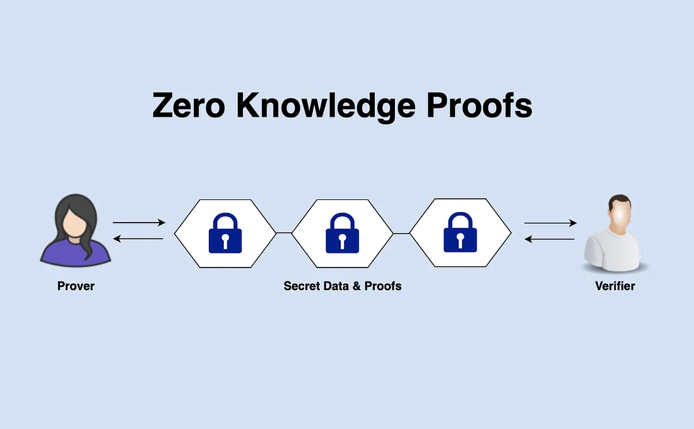

Beginner’s Guide To Understanding Zero Knowledge Proofs

So basically from what i understood,its a way of gaslighting someone into thinking you have information that you actually have with you.

But i never actually understood one thing

"How can someone give a proof that gives no evidence?"

But i have an idea of how to implement this

WALDO

You see waldo who was created by Martin Handford in 1987 was a character in a childrens book.
Basically dora the explorer who doesnt use drugs.

So let’s assume for a moment, Bob and Alice were playing the game, and Bob finds Waldo first, and informs Alice he has found Waldo, but Alice doubts its true. Can Bob find a way to convince Alice, that he truly knows where Waldo is, without revealing Waldo’s position to Alice?

Well this is a difficult one, but not impossible. Remember he can’t point at Waldo directly, or he would give out Waldo’s location to Alice. So rather, what he can do, is find a carbon paper probably twice the size of the original, and use it to cover the original picture. He could then make a little hole in it, which he can use to point out Waldo’s location.

Once, Bob takes away the carbon, he would have successfully convinced Alice that he truly knows Waldo’s location, but at the same time, Alice won’t still be able to decipher Waldo’s location, as the hole which Bob created in the second paper, could have covered any part of the original picture.

For a method to qualify as a ZKP, it must satisfy the following conditions:

Completeness: This condition simply means that if Bob (the prover) was honest and not lying, he should be able to totally convince Alice (the verifier), that he is saying the truth.
Soundness: This condition means that if Bob was a cheat, he should never be able to deceive Alice into believing his lies.
Zero-Knowledge: This condition simply means that Bob should be able to totally convince Alice, that he knows Waldo’s location, without revealing it.
