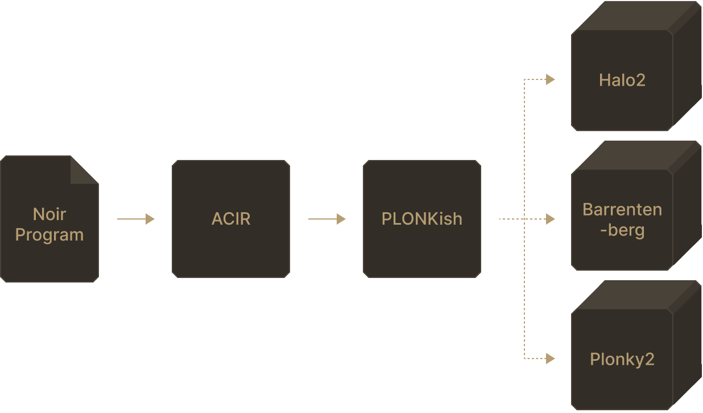

Zero-Knowledge SNARKS

Zero-knowledge proof is a broad term for proofs that can validate a specified statement without revealing any other information. zkSNARKs are a type of zero-knowledge proofs in blockchains.

In zkSNARKs, the statement to prove can be generalized to: "I know a secret 𝑤such that 𝐹(𝑥,𝑤)=𝑦", for:

Public program 𝐹
Public values 𝑥 and 𝑦
Secret witness 𝑤

